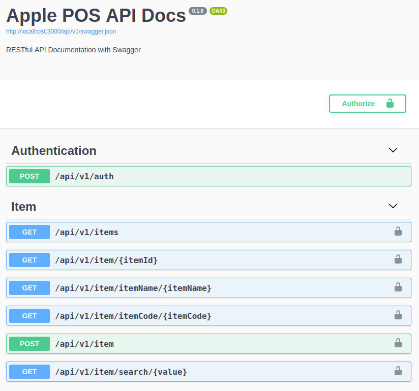
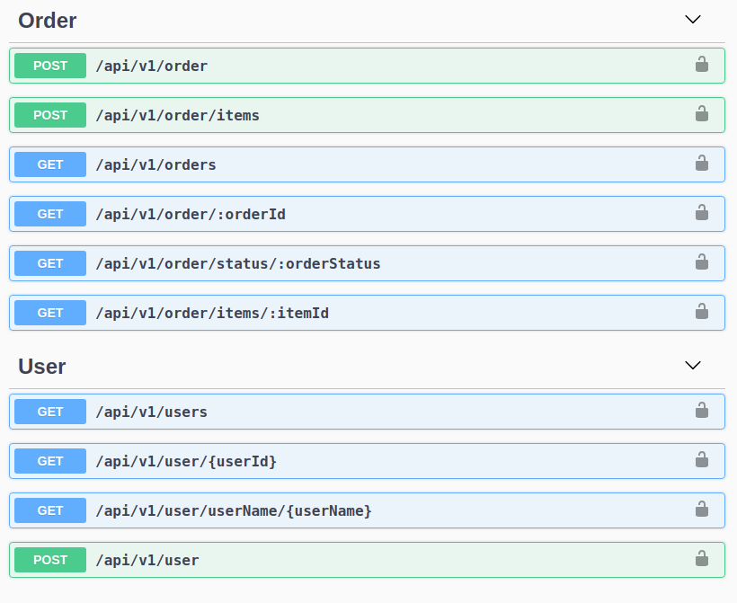

# POS-server

## How to run

1. Clone and enter the project directory
2. run ```npm install``` command in your terminal
3. run ```npm start dev``` command, then the POS system will be launched in your default browser.

### API Schemas - Swagger Image Attachement

* Navigate to ```http://localhost:3000/swagger3/``` to get the API Swagger Documentation of this server.



